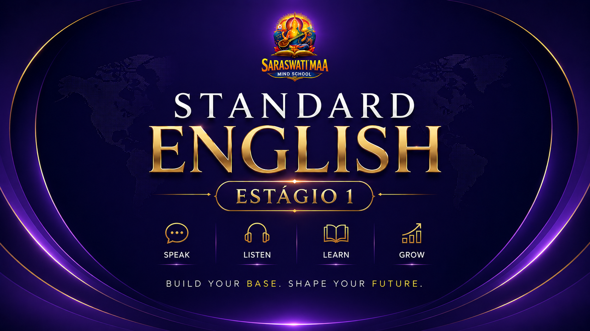
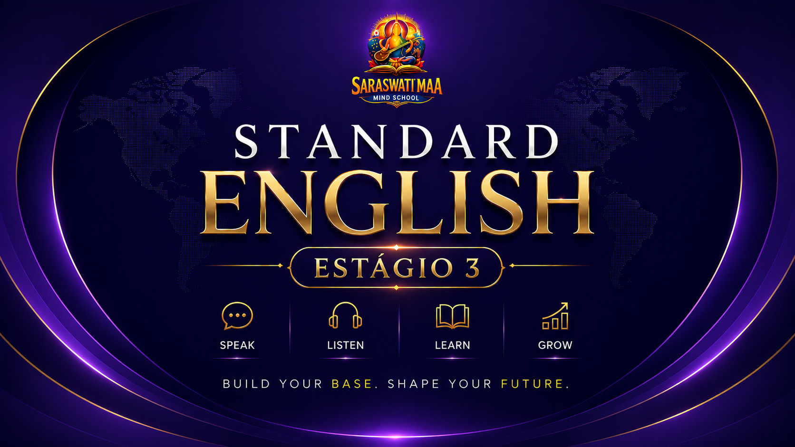

<!DOCTYPE html>
<html lang="pt-BR">
<head>
    <meta charset="UTF-8">
    <meta name="viewport" content="width=device-width, initial-scale=1.0">
    <base href="./">
    <meta http-equiv="X-UA-Compatible" content="IE=edge">
    <meta name="author" content="S.M.S - Academia de Linguas & Habilidades">
    <meta name="description" content="S.M.S - Academia de Linguas & Habilidades - Aprenda idiomas e desenvolva novas competências. Agende suas aulas hoje!">
    <meta name="keywords" content="Academia de Linguas, Idiomas, Habilidades, Cursos, Aprendizado, Inglês, Francês, Alemão, Espanhol">
    <meta name="robots" content="index, follow">
    <link rel="canonical" href="./">
    <meta property="og:url" content="./">
    <meta property="og:type" content="website">
    <meta property="og:title" content="Saraswati MAA Mind School - Aprenda com Profissionais Experientes">
    <meta property="og:description" content="S.M.S - Academia de Linguas & Habilidades - Aprenda idiomas e desenvolva novas competências. Agende suas aulas hoje!">
    <meta property="og:image" content="Image/favicon.jpg">
    <!-- Título da página, utilizado em navegadores, pesquisas e resultados de mecanismos de busca -->
    <title>Saraswati MAA Mind School - Aprenda com Profissionais Experientes</title>
    <link rel="stylesheet" href="https://cdnjs.cloudflare.com/ajax/libs/font-awesome/6.4.0/css/all.min.css">
    <link rel="stylesheet" href="style.css">
    <link rel="icon" type="image/png" href="Image/favicon.jpg">
    
    
    
    
    

    
</head>
<body>
    

    

    

        

            

                <a href="#cursos" class="ticker-link" onclick="event.preventDefault(); openCourseCatalog();">Cursos</a>
                <a href="#sms-gallery" class="ticker-link" onclick="event.preventDefault(); openSmsGallery();">Galeria</a>
                <a href="#contato" class="ticker-link" onclick="event.preventDefault(); scrollToContacts();">Contato</a>
                <a href="Privacidade & termos.html" class="ticker-link" onclick="event.preventDefault(); window.open('Privacidade & termos.html', '_blank');">Termos</a>
                

                    <button type="button" class="lang-globe-btn" onclick="toggleLanguagePicker(event)" aria-label="Traduzir para outro idioma">🌐</button>
                    

                        <button type="button" onclick="changeLanguage('en'); closeLanguagePicker();" role="menuitem">English</button>
                        <button type="button" onclick="changeLanguage('fr'); closeLanguagePicker();" role="menuitem">Français</button>
                        <button type="button" onclick="changeLanguage('es'); closeLanguagePicker();" role="menuitem">Español</button>
                    

                

                <button id="infoToggleAllBtn" class="buy-button info-toggle-button" type="button" onclick="toggleAllInfoSections()">Ver informações</button>
                <button id="buyMenuToggleBtn" type="button" class="ticker-link" onclick="toggleBuyMenu()">Manuais</button>
                  <a href="FAQ.html" class="ticker-link">FAQ</a>
            

        

    

    <!-- HEADER COM MENU -->
    <header>
        

            
            
            <h1 class="store-name">S.M.S - Academia de Linguas & Habilidades</h1>
            

                    

                        <h2>Manuais por Categoria</h2>
                        <button type="button" class="buy-menu-close site-close-button" onclick="hideBuyMenu()" aria-label="Fechar menu">×</button>
                    

                    

                        <!-- STANDARD ENGLISH -->
                        

                            
                            

                                <h3 class="manual-category-title">Standard English</h3>
                                
Programa completo com os fundamentos essenciais do inglês. Este pacote inclui:

                                <ul class="manual-list">
                                    <li>Standard Vocabulary</li>
                                    <li>Standard Grammar</li>
                                    <li>Standard Dialogue</li>
                                    <li>Standard Practicing</li>
                                </ul>
                                
💰Preço:<strong>5.000 Kz</strong>

                                

                                    <button type="button" onclick="openPurchaseFormWithoutPassword('Standard English - Pacote Completo', '1', '5.000 Kz')">Comprar</button>
                                    <button type="button" class="get-now-btn" onclick="openPasswordModal('Standard', 'Study')">Estudar</button>
                                

                            

                        

                        <!-- FOUNDATION ENGLISH -->
                        

                            
                            

                                <h3 class="manual-category-title">Foundation English</h3>
                                
Nível intermediário com conceitos avançados de linguagem. Este pacote inclui:

                                <ul class="manual-list">
                                    <li>Foundation Vocabulary</li>
                                    <li>Foundation Grammar</li>
                                    <li>Foundation Dialogue</li>
                                    <li>Foundation Practicing</li>
                                </ul>
                                
💰 Preço: <strong>5.000 Kz</strong>

                                

                                    <button type="button" onclick="openPurchaseFormWithoutPassword('Foundation English - Pacote Completo', '2', '5.000 Kz')">Comprar</button>
                                    <button type="button" class="get-now-btn" onclick="openPasswordModal('Foundation', 'Study')">Estudar</button>
                                

                            

                        

                        <!-- INTERMEDIATE ENGLISH -->
                        

                            
                            

                                <h3 class="manual-category-title">Intermediate English</h3>
                                
Aprofundamento da linguagem com foco em fluência e expressão. Este pacote inclui:

                                <ul class="manual-list">
                                    <li>Intermediate Vocabulary</li>
                                    <li>Intermediate Grammar</li>
                                    <li>Intermediate Dialogue</li>
                                    <li>Intermediate Practicing</li>
                                </ul>
                                
💰 Preço: <strong>5.000 Kz</strong>

                                

                                    <button type="button" onclick="openPurchaseFormWithoutPassword('Intermediate English - Pacote Completo', '3', '5.000 Kz')">Comprar</button>
                                    <button type="button" class="get-now-btn" onclick="openPasswordModal('Intermediate', 'Study')">Estudar</button>
                                

                            

                        

                        <!-- FLUENCY ACCELERATION -->
                        

                            
                            

                                <h3 class="manual-category-title">Aceleração da Fluência</h3>
                                
Método revolucionário para falar inglês com naturalidade e confiança. Este pacote inclui:

                                <ul class="manual-list">
                                    <li>Fluency Acceleration Vocabulary</li>
                                    <li>Fluency Acceleration Grammar</li>
                                    <li>Fluency Acceleration Dialogue</li>
                                    <li>Fluency Acceleration Practicing</li>
                                </ul>
                                
💰 Preço: <strong>5.000 Kz</strong>

                                

                                    <button type="button" onclick="openPurchaseFormWithoutPassword('Aceleração da Fluência - Pacote Completo', '4', '5.000 Kz')">Comprar</button>
                                    <button type="button" class="get-now-btn" onclick="openPasswordModal('Fluency Acceleration', 'Study')">Estudar</button>
                                

                            

                        

                        <!-- PROGRAMA KIDS (JOY) -->
                        

                            
                            

                                <h3 class="manual-category-title">Programa Kids (Joy)</h3>
                                
Aprendizado lúdico e divertido para crianças. Este pacote inclui:

                                <ul class="manual-list">
                                    <li>Joy Vocabulary</li>
                                    <li>Joy Grammar</li>
                                    <li>Joy Dialogue</li>
                                    <li>Joy Practicing</li>
                                </ul>
                                
💰 Preço: <strong>5.000 Kz</strong>

                                

                                    <button type="button" onclick="openPurchaseFormWithoutPassword('Programa Kids Joy - Pacote Completo', '5', '5.000 Kz')">Comprar</button>
                                    <button type="button" class="get-now-btn" onclick="openPasswordModal('Joy', 'Study')">Estudar</button>
                                

                            

                        

                        <!-- PACOTE AUTODIDATA -->
                        

                            
                            

                                <h3 class="manual-category-title">Pacote Autodidata</h3>
                                
Aprendizado autônomo e autodirigido para alunos independentes. Este pacote inclui:

                                <ul class="manual-list">
                                    <li>Autodidata Vocabulary</li>
                                    <li>Autodidata Grammar</li>
                                    <li>Autodidata Dialogue</li>
                                    <li>Autodidata Practicing</li>
                                </ul>
                                
💰 Preço: <strong>5.000 Kz</strong>

                                

                                    <button type="button" onclick="openPurchaseFormWithoutPassword('Pacote Autodidata - Completo', '6', '5.000 Kz')">Comprar</button>
                                    <button type="button" class="get-now-btn" onclick="openPasswordModal('Autodidata', 'Study')">Estudar</button>
                                

                            

                        

                    

                        

                            

                                <h3 id="selectedManualTitle">Pedido de compra</h3>
                                
Preencha os dados abaixo para receber o manual rapidamente ou receber de forma física.

                            

                            
Preço: —

                            <form id="purchaseRequestForm" class="purchase-request-form" onsubmit="return false;">
                                <label for="buyerName">Nome completo</label>
                                <input type="text" id="buyerName" placeholder="Ex: João Silva" required>

                                <label for="buyerEmail">Email</label>
                                <input type="email" id="buyerEmail" placeholder="seu@email.com" required>

                                <label for="courseType">Tipo de curso</label>
                                <select id="courseType" required>
                                    <option value="">Selecione...</option>
                                    <option value="Inglês">Inglês</option>
                                    <option value="Francês">Excel Avançado</option>
                                    <option value="Alemão">Gestão de Projetos</option>
                                    <option value="Espanhol">Higiene & Segurança No Trabalho</option>
                                    <option value="Italiano">Informática Na Óptica do Utilizador</option>
                                    <option value="Português">Logística Internacional</option>
                                    <option value="Outro">Outro</option>
                                </select>

                                <label for="proofFile" class="full-width">Comprovante de pagamento</label>
                                <input type="file" id="proofFile" accept="application/pdf" required>

                                <input type="hidden" id="purchaseManualId">
                                <input type="hidden" id="purchaseManualPrice">
                                

                                    <button type="button" class="purchase-submit-button" onclick="submitPurchaseRequest()">Virtual</button>
                                    <button type="button" class="purchase-submit-button" onclick="submitPhysicalPurchaseRequest()">Físico</button>
                                    <button type="button" class="purchase-cancel-button" onclick="closePurchaseForm()">Cancelar</button>
                                

                                
📋 Use Virtual para finalizar por email   Físico para abrir o WhatsApp com  instruções de entrega impressa.

                                

                            </form>
                        

                        

                            
Documento solicitado: —

                            

                                
<strong>Nome:</strong> —

                                
<strong>Email:</strong> —

                                
<strong>Curso:</strong> —

                                
<strong>Comprovativo:</strong> —

                                
<strong>Preço:</strong> 

                            

                            

                                <button id="downloadChosenBtn" class="purchase-submit-button" onclick="downloadRequestedDocument()">Baixar documento</button>
                                <button id="invoiceBtn" class="purchase-submit-button" onclick="generateInvoice()">Receber Fatura</button>
                            

                        

                    

                

            

        </header>

        <section class="banner">
            

                

                    

                        <h2>Conquiste fluência com aulas práticas</h2>
                        
Metodologia SMS: conversação, vocabulário e gramática em um único percurso.

                    

                

                

                    

                        <h2>Turmas reduzidas e atenção individual</h2>
                        
Professores experientes orientando cada passo do aluno para resultados rápidos.

                    

                

                

                    

                        <h2>Aulas Online e Presenciais em Luanda</h2>
                        
Flexibilidade para estudar de qualquer lugar com horários adaptados à sua rotina.

                    

                

                

                    

                        <h2>Recursos exclusivos para alunos</h2>
                        
Manuais, vídeos e suporte via WhatsApp para manter o estudo ativo todos os dias.

                    

                

                

                    

                        <h2>Inscrições abertas agora</h2>
                        
Garanta sua vaga e avance no inglês com um plano pedagógico completo.

                    

                

            

            

                
                
                
                
                
            

        </section>

        <section class="info-highlight-card">
            

                Por que escolher a SMS
                <h2>Aprender inglês com método claro, apoio real e resultados visíveis.</h2>
                
Na S.M.S, cada aluno recebe orientação prática, recursos completos e uma experiência de estudo organizada para crescer com confiança.

            

            

                Metodologia prática
                Professores experientes
                Aulas online e presenciais
                Suporte contínuo
            

        </section>

        

            

                

                    Informações da SMS
                    <h2>Tudo o que você precisa saber em um só lugar</h2>
                

                <button type="button" class="info-system-close-button site-close-button" onclick="toggleAllInfoSections()" aria-label="Ocultar informações">×</button>
            

            

                <section class="info-section opened">
                    

                        

                            <article class="info-card info-location-card">
                                
📍 Localização & contato

                                
Academia em Luanda, com atendimento personalizado e aulas online ou presenciais.

                                

                                    
<strong>Endereço:</strong> Av. Deolinda Rodrigues, nº 475, Rangel, Luanda, Angola

                                    
<strong>Horário:</strong> Segunda a Sexta, 07:30 - 20:00

                                    
<strong>Telefone:</strong> +244 951 474872

                                    
<strong>Email:</strong> VendasRhSms@outlook.com

                                

                                

                                    <iframe src="https://maps.google.com/maps?q=Av.+Deolinda+Rodrigues+475+Luanda+Angola&output=embed" loading="lazy" referrerpolicy="no-referrer-when-downgrade" title="Mapa da S.M.S"></iframe>
                                

                            </article>
                            <article class="info-card">
                                <h3>🏛️ Sobre nós</h3>
                                
A S.M.S é uma academia de idiomas e habilidades que combina metodologia moderna, apoio personalizado e foco em resultados reais.

                                <ul>
                                    <li>Academia de especialização em formação de adultos e jovens.</li>
                                    <li>Equipe de professores qualificados, motivados e bilíngues.</li>
                                    <li>Aulas adaptadas ao ritmo e objetivos de cada aluno.</li>
                                    <li>Ambiente acolhedor e suporte contínuo durante o aprendizado.</li>
                                </ul>
                            </article>
                            <article class="info-card">
                                <h3>💳 Pagamentos e comprovante</h3>
                                
As inscrições são confirmadas após o envio do comprovativo de pagamento.

                                <ul>
                                    <li><strong>Banco:</strong> Milénio Atlântico</li>
                                    <li><strong>Titular:</strong> Estevão André Lizi</li>
                                    <li><strong>Conta:</strong> 226182555.10001</li>
                                    <li><strong>IBAN:</strong> 0055.0000.2618.2555.1010.7</li>
                                    <li><strong>Referência:</strong> SMS-ACADEMIA DE LÍNGUAS-2026</li>
                                </ul>
                            </article>
                            <article class="info-card" id="termos-privacidade">
                                <h3>🔒 Termos e privacidade</h3>
                                
Seu contato e dados são tratados com responsabilidade e usados apenas para apoiar o processo educativo.

                                <ul>
                                    <li>Política clara de uso e proteção de dados</li>
                                    <li>Informações objetivas sobre aulas e políticas</li>
                                    <li>Atendimento transparente para alunos e responsáveis</li>
                                </ul>
                            </article>
                        

                        

                            <article class="info-card partner-panel">
                                <h3>🤝 Parceiros estratégicos</h3>
                                
Parceiros que ampliam oportunidades e apoio para os nossos alunos.

                                

                                    

                                        <a class="partner-link" href="https://horizon-groupindia.com/" target="_blank" rel="noopener noreferrer">
                                            
                                        </a>
                                        HORIZON-GROUP PVT
                                        
Empresa especializada em soluções de Desminagem emuito mais, globalmente.

                                    

                                    

                                        <a class="partner-link" href="https://www.inefop.gov.ao/" target="_blank" rel="noopener noreferrer">
                                            
                                        </a>
                                        INEFOP-LUANDA
                                        
Rede de apoio e recursos para instituições educacionais em Luanda.

                                    

                                    

                                        <a class="partner-link" href="https://www.governo.gov.ao" target="_blank" rel="noopener noreferrer">
                                            
                                        </a>
                                        GOVERNO ANGOLA
                                        
Rede de eventos, workshops e intercâmbios para alunos SMS.

                                    

                                

                            </article>
                            <article class="info-card testimonial-panel">
                                <h3>🌟 Depoimentos e impacto</h3>
                                
Alunos reais, experiências reais e resultados visíveis.

                                

                                    

                                        

                                            
                                        

                                        
“A SMS me deu confiança para falar inglês em entrevistas e viagens. A equipe acompanha cada etapa.”

                                        
★★★★★

                                        Rita M., estudante
                                    

                                    

                                        

                                            
                                        

                                        
“Os professores são excelentes e o método é prático. Senti progresso real desde as primeiras semanas.”

                                        
★★★★★

                                        João P., profissional
                                    

                                    

                                        

                                            
                                        

                                        
“O ambiente é acolhedor e o suporte personalizado faz toda a diferença no aprendizado.”

                                        
★★★★★

                                        Ana L., aluna
                                    

                                

                            </article>
                        

                    

                </section>
            

        

        <section class="gallery sms-gallery-section" id="sms-gallery" hidden>
            

                <button class="site-close-button gallery-close" aria-label="Fechar galeria" onclick="closeSmsGallery()">✕</button>
                

                    Galeria institucional
                    

                        <button type="button" class="sms-tab active" data-target="photosDemo" role="tab" aria-selected="true">Fotos</button>
                        <button type="button" class="sms-tab" data-target="videoDemo" role="tab" aria-selected="false">Vídeos</button>
                    

                

                

                    <!-- Fotos (demo intercalado em uma única linha) -->
                    

                        

                            

                                
                                <strong class="sms-gallery-card-title">Brevemente</strong>
                                O curso de gestão de projetos estará disponível em breve.
                            

                             

                              
                                <strong class="sms-gallery-card-title">Brevemente</strong>
                                O curso de Excel Avançado estará disponível em breve, só aqui na Academia SMS.
                            

                             

                              
                                <strong class="sms-gallery-card-title">Brevemente</strong>
                                O curso de Informática estará disponível em breve, na Academia SMS.
                            

                             

                              
                                <strong class="sms-gallery-card-title">Brevemente</strong>
                                A Academia SMS disponibilizará o curso de Higiene e Segurança no Trabalho em breve.
                            

                            

                              
                                <strong class="sms-gallery-card-title">Brevemente</strong>
                                A Academia SMS disponibilizará o curso de Logística Internacional muito em breve, fique ligado.
                            

                            

                                
                                <strong class="sms-gallery-card-title">Sobre nós</strong>
                                Venha nos visitar
                            

                            

                                
                                <strong class="sms-gallery-card-title">A nossa equipa</strong>
                                Professores dedicados e treinados
                            

                             

                                
                                <strong class="sms-gallery-card-title">A nossa equipa</strong>
                                Colaboradores dedicados e profissionais
                            

                            

                                
                                <strong class="sms-gallery-card-title">O nosso espaço</strong>
                                Salas confortáveis e modernas
                            

                            

                                
                                <strong class="sms-gallery-card-title">Mr Steve</strong>
                                Professor de Inglês Prof. Steve Number 1 na SMS.
                            

                            

                                
                                <strong class="sms-gallery-card-title">O nosso espaço</strong>
                                Localizados na Terra Nova BFA do Volante
                            

                            

                                
                                <strong class="sms-gallery-card-title">O nosso espaço</strong>
                                Logo após a pedonal do cemiterio da Santa Ana
                            

                        

                    

                    

                        

                            

                                <button class="video-prev" aria-label="Anterior">‹</button>
                              
                                

                                    
<video controls muted playsinline preload="metadata" src="GALERIA DE VIDEOS/1-SMS Academia de Formação.mp4"></video>

                                    
<video controls muted playsinline preload="metadata" src="GALERIA DE VIDEOS/3-VID- Oque temos ara o mes de agosto.mp4"></video>

                                    
<video controls muted playsinline preload="metadata" src="GALERIA DE VIDEOS/6-VID JOY DUNKIN 1.mp4"></video>

                                    
<video controls muted playsinline preload="metadata" src="GALERIA DE VIDEOS/4-VID-Interview with tino.mp4"></video>

                                    
<video controls muted playsinline preload="metadata" src="GALERIA DE VIDEOS/FINAL DOS VIDEOS.mp4"></video>

                                

                                <button class="video-next" aria-label="Próximo">›</button>
                            

                            

                        

                    

                

            

        </section>

        <main>
            <section class="hero">
                

                    

                        Academia de Línguas com foco em resultados
                        <h1>Aprenda inglês com aulas práticas e apoio personalizado.</h1>
                        
A S.M.S ajuda você a dominar inglês para trabalho, viagens e estudos com métodos adaptados ao seu ritmo e objetivos.

                    

                    

                        <h2>Destaques SMS</h2>
                        <ul>
                            <li>Turmas reduzidas e acompanhamento individual</li>
                            <li>Cursos para nível básico, intermediário e profissional</li>
                            <li>Material digital, propina e a inscrição podem ser pago apartir do site, suporte via WhatsApp</li>
                            <li>Atendimento em Luanda aulas online e presencial</li>
                        </ul>
                    

                

            </section>

    <!-- DASHBOARD COM CURSOS -->
    <section class="dashboard" id="cursos">   
        <h2 class="section-title">Catálogo de Cursos</h2>

        

            <button class="program-nav-arrow" data-side="prev" type="button" onclick="changeProgram(-1)" aria-label="Programa anterior">‹</button>
            

                

                    

                        

                            
                            

                                <h3>Programa Básico</h3>
                                
Base sólida para quem quer começar do zero e evoluir de forma prática.

                            

                        

                        

                            

                                
                                

                                    
Standard English – Estágio 1

                                    
Modalidade: Presencial

                                    
5.000 KZ

                                    

                                        <button class="buy-button" onclick="bookCourse('Standard English – Estágio 1', 5000.00); showRegistrationAndPayment();">Inscrever-se</button>
                                        <button class="buy-button propina-btn" onclick="openProptinaModal('Standard English – Estágio 1', 5000.00);">Propina</button>
                                    

                                

                            

                            

                                
                                

                                    
Standard English – Estágio 2

                                    
Modalidade: Presencial

                                    
8.000 KZ

                                    

                                        <button class="buy-button" onclick="bookCourse('Standard English – Estágio 2', 8000.00); showRegistrationAndPayment();">Inscrever-se</button>
                                        <button class="buy-button propina-btn" onclick="openProptinaModal('Standard English – Estágio 2', 8000.00);">Propina</button>
                                    

                                

                            

                            

                                
                                

                                    
Standard English – Estágio 3

                                    
Modalidade: Presencial

                                    
12.500 KZ

                                    

                                        <button class="buy-button" onclick="bookCourse('Standard English – Estágio 3', 12500.00); showRegistrationAndPayment();">Inscrever-se</button>
                                        <button class="buy-button propina-btn" onclick="openProptinaModal('Standard English – Estágio 3', 12500.00);">Propina</button>
                                    

                                

                            

                        

                    

                    

                        

                            
                            

                                <h3>Programa Geral</h3>
                                
Para quem já tem base e quer ganhar fluência e confiança em comunicação.

                            

                        

                        

                            

                                
                                

                                    
Foundation English

                                    
15.000 KZ / mês

                                    

                                        <button class="buy-button" onclick="bookCourse('Foundation English', 15000.00); showRegistrationAndPayment();">Inscrever-se</button>
                                        <button class="buy-button propina-btn" onclick="openProptinaModal('Foundation English', 15000.00);">Propina</button>
                                    

                                

                            

                            

                                
                                

                                    
Intermediate English

                                    
20.000 KZ / mês

                                    

                                        <button class="buy-button" onclick="bookCourse('Intermediate English', 20000.00); showRegistrationAndPayment();">Inscrever-se</button>
                                        <button class="buy-button propina-btn" onclick="openProptinaModal('Intermediate English', 20000.00);">Propina</button>
                                    

                                

                            

                            

                                
                                

                                    
Aceleração da Fluência

                                    
25.000 KZ

                                    

                                        <button class="buy-button" onclick="bookCourse('Aceleração da Fluência', 25000.00); showRegistrationAndPayment();">Inscrever-se</button>
                                        <button class="buy-button propina-btn" onclick="openProptinaModal('Aceleração da Fluência', 25000.00);">Propina</button>
                                    

                                

                            

                        

                    

                    

                        

                            
                            

                                <h3>Programa Profissional</h3>
                                
Preparação para contextos de trabalho, negócios e oportunidades internacionais.

                            

                        

                        

                            

                                
                                

                                    
Professional English

                                    
20.000 KZ - 180.000 KZ

                                    

                                        <button class="buy-button" onclick="bookCourse('Professional English', 20000.00); showRegistrationAndPayment();">Inscrever-se</button>
                                        <button class="buy-button propina-btn" onclick="openProptinaModal('Professional English', 20000.00);">Propina</button>
                                    

                                

                            

                            

                                
                                

                                    
Preparatório

                                    
15.000 KZ / aula

                                    

                                        <button class="buy-button" onclick="bookCourse('Preparatório', 15000.00); showRegistrationAndPayment();">Inscrever-se</button>
                                        <button class="buy-button propina-btn" onclick="openProptinaModal('Preparatório', 15000.00);">Propina</button>
                                    

                                

                            

                            

                                
                                

                                    
Habilidades de Comunicação

                                    
18.000 KZ / aula

                                    

                                        <button class="buy-button" onclick="bookCourse('Habilidades de Comunicação', 18000.00); showRegistrationAndPayment();">Inscrever-se</button>
                                        <button class="buy-button propina-btn" onclick="openProptinaModal('Habilidades de Comunicação', 18000.00);">Propina</button>
                                    

                                

                            

                        

                    

                    

                        

                            
                            

                                <h3>Programa Kids</h3>
                                
Ensino lúdico e progressivo para crianças aprenderem inglês com prazer.

                            

                        

                        

                            

                                
                                

                                    
Programa Kids

                                    
26.500 KZ / mês

                                    

                                        <button class="buy-button" onclick="bookCourse('Programa Kids', 26500.00); showRegistrationAndPayment();">Inscrever-se</button>
                                        <button class="buy-button propina-btn" onclick="openProptinaModal('Programa Kids', 26500.00);">Propina</button>
                                    

                                

                            

                        

                    

                    

                        

                            
                            

                                <h3>Programas Flexíveis</h3>
                                
Opções adaptadas à rotina, ao domicilio e à aprendizagem autónoma.

                            

                        

                        

                            

                                
                                

                                    
Aulas ao Domicílio

                                    
30.000 KZ / mês

                                    

                                        <button class="buy-button" onclick="bookCourse('Aulas ao Domicílio', 30000.00); showRegistrationAndPayment();">Inscrever-se</button>
                                        <button class="buy-button propina-btn" onclick="openProptinaModal('Aulas ao Domicílio', 30000.00);">Propina</button>
                                    

                                

                            

                            

                                
                                

                                    
Club Meetings

                                    
Grátis

                                    <a class="buy-button free" role="button" href="https://chat.whatsapp.com/H2eDhya4kXm4hmZ5G95BXL?s=sw&p=a&ilr=4&amv=3" target="_blank" rel="noopener noreferrer">Entrar no grupo</a>
                                

                            

                            

                                
                                

                                    
Pacote Autodidata

                                    
10.000 KZ

                                    

                                        <button class="buy-button" onclick="bookCourse('Pacote Autodidata (25 aulas)', 10000.00); showRegistrationAndPayment();">Inscrever-se</button>
                                        <button class="buy-button propina-btn" onclick="openProptinaModal('Pacote Autodidata (YouTube + WhatsApp)', 10000.00);">Propina</button>
                                    

                                

                            

                        

                    

                

            

            <button class="program-nav-arrow" data-side="next" type="button" onclick="changeProgram(1)" aria-label="Próximo programa">›</button>
        

    </section>
    <!-- FORMULÁRIO PARA INSCRIÇÃO -->
    <section id="agendamento" class="migrated-inline-087">
        

            

                <h2 class="migrated-inline-089">📱 Inscrever-se</h2>
                <button type="button" onclick="closeEnrollmentForm()" aria-label="Fechar formulário" class="migrated-inline-090">×</button>
            

            
Preencha todos os campos abaixo para inscrever-se em seu curso ou entre em contato conosco

            
            

                <label for="courseName">📚 Curso:</label>
                <input type="text" id="courseName" placeholder="Nome do curso" readonly class="migrated-inline-092">
            

            

                <label for="courseVariantSelect" id="courseVariantLabel">Opção:</label>
                <select id="courseVariantSelect" class="migrated-inline-093">
                    <option value="">Selecione uma opção...</option>
                </select>
            

            

                <label for="coursePrice">💵 Preço:</label>
                <input type="text" id="coursePrice" placeholder="Preço do curso" readonly class="migrated-inline-092">
                <input type="hidden" id="courseBasePrice" value="0">
            

            

                
🧭 Como deseja estudar? (Escolha uma opção)

                

                    <label class="radio-option" for="enrollModalityOnline"><input id="enrollModalityOnline" type="radio" name="enrollModality" value="online">Online</label>
                    <label class="radio-option" for="enrollModalityPresencial"><input id="enrollModalityPresencial" type="radio" name="enrollModality" value="presencial">Presencial</label>
                

                

            

            

                <label for="scheduleDate">📅 Data Preferida:</label>
                <input type="date" id="scheduleDate" required>
            

            

                <label for="scheduleTime">⏰ Horário Preferido:</label>
                <select id="scheduleTime" required class="migrated-inline-093">
                    <option value="">Selecione um horário...</option>
                    <option value="08:00">08:00</option>
                    <option value="10:00">10:00</option>
                    <option value="12:00">12:00</option>
                    <option value="14:00">14:00</option>
                    <option value="16:00">16:00</option>
                    <option value="18:00">18:00</option>
                    <option value="online">Online</option>
                </select>
            

            

                <label for="name">👤 Seu Nome Completo:</label>
                <input type="text" id="name" placeholder="Digite seu nome completo" required>
            

            

                <label for="phone">📱 Número de telemovél:</label>
                <input type="tel" id="phone" placeholder="+244 951474872" required>
            

            

                <label for="email">📧 Email:</label>
                <input type="email" id="email" placeholder="VendasRhSms@outlook.com" required>
            

            

                <label for="idNumber">🆔 BI / Passaporte:</label>
                <input type="text" id="idNumber" placeholder="Ex: 123456789AB123 (BI) ou AB1234567 (Passaporte)" class="migrated-inline-095" required>
                <small class="migrated-inline-096">Seu documento será para nossa base de dados.</small>
            

            

                <label for="municipality">🏘️ Localização:</label>
                <select id="municipality" required class="migrated-inline-093">
                    <option value="">Selecione um município...</option>
                    <option value="Luanda">Online</option>
                    <option value="Estrangeiro">Estrangeiro</option>
                    <option value="Luanda">Luanda</option>
                    <option value="Rangel">Rangel</option>
                    <option value="Bengo">Bengo</option>
                    <option value="Benguela">Benguela</option>
                    <option value="Bié">Bié</option>
                    <option value="Cabinda">Cabinda</option>
                    <option value="Cuando Cubango">Cuando Cubango</option>
                    <option value="Cuanza Norte">Cuanza Norte</option>
                    <option value="Cuanza Sul">Cacuaco</option>
                    <option value="Cunene">Icolo & Bengo</option>
                    <option value="Palanca">Palanca</option>
                    <option value="Capolo">Capolo</option>
                    <option value="Kina-xixi">Kina-xixi</option>
                    <option value="Samba">Samba</option>
                    <option value="Sapú">Sapú</option>
                    <option value="Terra Nova">Terra Nova</option>
                    <option value="Talatona">Talatona</option>
                    <option value="Camama">Camama</option>
                    <option value="Nova Vida">Nova Vida</option>
                    <option value="Benfica">Benfica</option>
                    <option value="Viana">Viana</option>
                    <option value="Cacuaco">Cacuaco</option>
                    <option value="Kilamba Kiaxi">Kilamba Kiaxi</option>
                    <option value="Outros">Outros</option>
                </select>
            

            

                <label for="notes">📝 Observações:</label>
                <textarea id="notes" placeholder="Alguma observação adicional?" class="migrated-inline-097"></textarea>
            

            

                <i>Após clicar no botão abaixo, você será redirecionado para confirmar a Inscrição.</i>
            

            
            

                <button class="whatsapp-button" onclick="proceedToPayment()">
                    💬 Ir para pagamento
                </button>
            

        

    </section>
    
    <!-- MODAL DE PAGAMENTO DE PROPINAS -->
    

        

            

                

                    <h2>💳 Formulário de Propina</h2>
                    <button type="button" class="propina-modal-close site-close-button" onclick="closeProptinaModal()" aria-label="Fechar modal">×</button>
                

                

                    
<strong >IBAN para Pagamento:</strong>

                    
0055.0000.2618.2555.1010.7

                    

                        <strong>⚠️ Instruções:</strong> Efetue o pagamento para o IBAN acima, preencha os dados abaixo e anexe o comprovante antes de clicar em "Eu paguei".
                    

                

            

            <form id="propina-form" class="propina-form" onsubmit="submitProptinaForm(event);">
                <!-- Dados do Cliente -->
                <fieldset class="propina-fieldset">
                    <legend>📋 Dados do Cliente</legend>
                    

                        <label for="propina-name">Nome Completo:</label>
                        <input type="text" id="propina-name" name="name" placeholder="Ex: João Silva" required>
                    

                    

                        <label for="propina-email">E-mail:</label>
                        <input type="email" id="propina-email" name="email" placeholder="seu@email.com" required>
                    

                    

                        <label for="propina-phone">Telefone / WhatsApp:</label>
                        <input type="tel" id="propina-phone" name="phone" placeholder="+244 9XX XXX XXX" required>
                    

                </fieldset>

                <!-- Objetivo do Pagamento -->
                <fieldset class="propina-fieldset">
                    <legend>🎯 Objetivo do Pagamento</legend>
                    

                        <label for="propina-course">Curso:</label>
                        <input type="text" id="propina-course" name="course" readonly placeholder="Curso será preenchido automaticamente" class="migrated-inline-101">
                    

                    

                        <label for="propina-stage">Estágio:</label>
                        <select id="propina-stage" name="stage" required>
                            <option value="">-- Selecione --</option>
                            <option value="Estágio 1">Estágio 1</option>
                            <option value="Estágio 2">Estágio 2</option>
                            <option value="Estágio 3">Estágio 3</option>
                        </select>
                    

                    

                        <label for="propina-purpose">Objetivo do pagamento:</label>
                        <input type="text" id="propina-purpose" name="purpose" placeholder="Ex: Propina / Avaliação / Continuidade" required>
                    

                </fieldset>

                <!-- Tipo de Pagamento -->
                <fieldset class="propina-fieldset">
                    <legend>💰 Tipo de Pagamento</legend>
                    

                        <label for="propina-type">Selecione o Tipo de Pagamento:</label>
                        <select id="propina-type" name="payment_type" required onchange="updatePaymentTypeFields();">
                            <option value="">-- Selecione --</option>
                            <option value="monthly">Dívida de Mensalidade</option>
                            <option value="package">Dívida de Pacote Único</option>
                            <option value="corporate">Pacote Empresas</option>
                        </select>
                    

                    <!-- Campos para Mensalidade -->
                    

                        <label for="propina-month">Referência da Mensalidade:</label>
                        <select id="propina-month" name="month_ref">
                            <option value="">-- Selecione --</option>
                            <option value="2º mês">2º mês</option>
                            <option value="3º mês">3º mês</option>
                            <option value="4º mês">4º mês</option>
                            <option value="5º mês">5º mês</option>
                            <option value="6º mês">6º mês</option>
                        </select>
                    

                    <!-- Campos para Pacote Único -->
                    

                        <label for="propina-package">Referência de Pacote Único:</label>
                        <select id="propina-package" name="package_ref">
                            <option value="">-- Selecione --</option>
                            <option value="Reforço">Reforço</option>
                            <option value="Segunda etapa">Segunda etapa</option>
                            <option value="Sessão de Avaliação">Sessão de Avaliação</option>
                            <option value="Plano de Continuidade">Plano de Continuidade</option>
                            <option value="Sessão Extra">Sessão Extra</option>
                            <option value="Apoio Intensivo">Apoio Intensivo</option>
                        </select>
                    

                    <!-- Campos para Pacote Empresas -->
                    

                        <label for="propina-corporate">Categoria de Pacote Empresas:</label>
                        <select id="propina-corporate" name="corporate_category" onchange="updateCorporateAmount();">
                            <option value="">-- Selecione --</option>
                            <option value="Business English">Business English — 70.000</option>
                            <option value="Academic English">Academic English — 60.000</option>
                            <option value="Travel English">Travel English — 20.000</option>
                            <option value="Professional English">Professional English — 50.000</option>
                            <option value="Technical English">Technical English — 40.000</option>
                            <option value="Specialized English">Specialized English — 180.000</option>
                            <option value="Team/Company 3 Member">Team/Company 3 Member — 100.000</option>
                        </select>
                    

                </fieldset>

                <!-- Montante a Pagar -->
                <fieldset class="propina-fieldset">
                    <legend>💵 Montante a Pagar</legend>
                    

                        <label for="propina-amount">Valor (KZ):</label>
                        <input type="number" id="propina-amount" name="amount" placeholder="Ex: 25000" step="0.01" readonly class="migrated-inline-101" required>
                    

                </fieldset>

                <!-- Anexar Comprovante -->
                <fieldset class="propina-fieldset">
                    <legend>📎 Comprovante de Pagamento</legend>
                    

                        <label for="propina-proof">Anexar Comprovante (Imagem/PDF):</label>
                        <input type="file" id="propina-proof" name="proof" accept="image/*,.pdf" required>
                        
Formatos aceitos: JPG, PNG, PDF (máx. 10 MB)

                    

                </fieldset>

                <!-- Botões -->
                

                    <button type="submit" class="propina-submit-btn">Eu paguei ✓</button>
                    <button type="button" class="propina-cancel-btn" onclick="closeProptinaModal();">Cancelar</button>
                

            </form>
        

    

    
    <!-- DADOS BANCÁRIOS E PAGAMENTO -->
    <section class="payment-section" id="pagamento" hidden>
        

            <h2 class="migrated-inline-106">💳 Dados Bancários & Comprovante de Pagamento</h2>
            

                <h3 class="migrated-inline-108">Resumo da Inscrição</h3>
                
<strong>Curso:</strong> —

                
<strong>Valor do curso:</strong> —

                
<strong>Taxa de inscrição:</strong> —

                
<strong>Total final:</strong> —

                
<strong>Referência:</strong> —

                
<strong>Nome:</strong> —

                
<strong>Telefone:</strong> —

                
<strong>Email:</strong> —

                
<strong>BI/Passaporte:</strong> —

                
<strong>Município:</strong> —

                
<strong>Data / Hora:</strong> —

                
<strong>Observações:</strong> —

            

            <!-- DADOS BANCÁRIOS -->
            

                <h3 class="migrated-inline-112">📋 Dados Bancários</h3>
                

                    

                        <label class="migrated-inline-069">Titulare da Conta:</label>
                        
Estevão André Lizi

                    

                    

                        

                            <label class="migrated-inline-069">Banco:</label>
                            
Milénio Atlântico

                            <label class="migrated-inline-114">Número da Conta:</label>
                            
226182555.10001

                        

                    

                    

                        

                            <label class="migrated-inline-069">IBAN:</label>
                            
0055.0000.2618.2555.1010.7

                            <button type="button" onclick="copyIBAN()" class="migrated-inline-116">Copiar IBAN</button>
                            <label class="migrated-inline-114">Referência:</label>
                            
SMS-ACADEMIA DE LÍNGUAS-2026

                        

                    

                

                

                    <strong>⚠️ Importante:</strong> Após efetuar o pagamento, envie o comprovante para confirmar sua inscrição.
                

            

            <!-- FORMULÁRIO DE ENVIO DE COMPROVANTE -->
            

                <h3 class="migrated-inline-118">📤 Enviar Comprovante de Pagamento</h3>
                 

                    <label for="proofAttachment">📎 Anexar Comprovante (Imagem/PDF):</label>
                    <input type="file" id="proofAttachment" accept="image/*,.pdf" class="migrated-inline-120">
                

                

                    <button id="enrollGenerateInvoiceBtn" type="button" onclick="generateEnrollmentInvoice()" disabled class="migrated-inline-122">Gerar Fatura</button>
                    <button id="enrollSendWhatsAppBtn" type="button" onclick="submitAllDataVia('whatsapp')" class="migrated-inline-123">Enviar Comprovante via WhatsApp</button>
                

                <!-- removed duplicate send buttons; kept single WhatsApp action above -->
                

                    <i>Todos os dados serão enviados junto com o comprovante de pagamento.</i>
                

            

        

    </section>

    <!-- MODAL DE COMPRA COM COMPROVATIVO (V2) -->
    

        

            <button class="purchase-password-close" onclick="closePurchaseFormWithPassword()">×</button>
            
            

                <h2 id="purchaseModalTitle">Comprar Manual</h2>
                
Preço: —

            

            

                
Preencha seus dados e envie o comprovativo de pagamento.

                <!-- SEÇÃO 1: Dados do Cliente (Editáveis) -->
                <fieldset class="purchase-fieldset">
                    <legend>📋 Seus Dados</legend>
                    
                    

                        <label for="purchaseFormName">👤 Nome Completo:</label>
                        <input type="text" id="purchaseFormName" placeholder="Ex: João Silva" required>
                    

                    

                        <label for="purchaseFormEmail">📧 Email:</label>
                        <input type="email" id="purchaseFormEmail" placeholder="seu@email.com" required>
                    

                    

                        <label for="purchaseFormPhone">📱 Telefone:</label>
                        <input type="tel" id="purchaseFormPhone" placeholder="+244 951474872" required>
                    

                </fieldset>

                <!-- SEÇÃO 1B: Seletor de Curso (Apenas para Standard) -->
                <fieldset class="purchase-fieldset" id="purchaseCourseSelector" style="display: block;">
                    <legend>📚 Selecione o Curso</legend>
                    
                    

                        <label for="purchaseCourseSelect">Qual curso você deseja?</label>
                        <select id="purchaseCourseSelect" required>
                            <option value="">-- Selecione --</option>
                            <option value="Standard 1">Standard 1</option>
                            <option value="Standard 2">Standard 2</option>
                            <option value="Standard 3">Standard 3</option>
                        </select>
                    

                </fieldset>

                <!-- SEÇÃO 2: Comprovativo de Pagamento -->
                <fieldset class="purchase-fieldset">
                    <legend>📄 Comprovativo de Pagamento</legend>
                    
                    

                        <label for="proofFileInput">
                            📎 Enviar Comprovativo (PDF, JPG, PNG):
                             <small style="color: #666;">Tamanho máximo: 10MB</small>
                        </label>
                        <input type="file" 
                               id="proofFileInput" 
                               accept=".pdf,.jpg,.jpeg,.png" 
                               onchange="validateProofUpload(event)" 
                               required>
                    

                    <!-- Feedback do Upload -->
                    

                </fieldset>

                <!-- SEÇÃO 3: Botão de Download (Aparece após comprovativo válido) -->
                

                    <button type="button" class="purchase-download-btn" onclick="processPurchaseDownload()">
                        📥 Baixar Meu Manual
                    </button>
                    
✓ Academia SMS Será notificada.

                

                <!-- Mensagem de Sucesso -->
                

                    
✅ Compra confirmada! Seu manual está sendo preparado.

                

                <!-- Botão de Cancelar -->
                <button type="button" class="purchase-cancel-btn" onclick="closePurchaseFormWithPassword()">Cancelar</button>
            

        

    

    <!-- Overlay de fundo -->
    

        </main>
    <!-- FOOTER -->
    <footer id="contato"> 
        <section id="contato-social">  
            
Visite as nossas redes sociais

        

            <a href="https://www.facebook.com/profile.php?id=61575589767936" target="_blank"><i class="fab fa-facebook"></i></a>
            <a href="https://www.instagram.com/saraswati.sms?igsh=eXduNjJvazhrZThl" target="_blank"><i class="fab fa-instagram"></i></a>
            <a href="https://www.linkedin.com/in/saraswati-maa-school-399831402?utm_source=share&utm_campaign=share_via&utm_content=profile&utm_medium=android_app" target="_blank"><i class="fab fa-linkedin"></i></a>
            <a href="https://wa.me/244951474872" target="_blank"><i class="fab fa-whatsapp"></i></a>
            <a href="https://youtube.com/@saraswatimaaschool?si=Cj7UdMQNY221QcJ6" target="_blank"><i class="fab fa-youtube"></i></a>
            <a href="https://pin.it/7Mj6hXgYW" target="_blank"><i class="fab fa-pinterest"></i></a>
            <a href="https://www.tiktok.com/@saraswati.maa.school?_r=1&_t=ZS-95SXQH2QT5u" target="_blank"><i class="fab fa-tiktok"></i></a>
            <a href="https://www.reddit.com/user/Imaginary-Shock5217/?utm_source=share&utm_medium=mweb3x&utm_name=mweb3xcss&utm_term=1&utm_content=share_button" target="_blank"><i class="fab fa-reddit"></i></a>
            <a href="FAQ.html" target="_blank">FAQ</a>
        

        <section id="contato-info" class="migrated-inline-125">
            
<strong>🕐 Horário de Atendimento:</strong> Segunda a Sexta, 07:30 - 18:00

        </section>
        
&copy; 2026 S.M.S - Academia de Linguas & Habilidades - Todos os direitos reservados.

        <!-- Botão de rolagem/voltar ao topo -->
<button id="scrollToTopBtn" title="Voltar ao topo" class="migrated-inline-087">up</button>
    </footer>

        <!-- Password Modal for Manual Download -->
        

            

                

                    <h3>📚 Obter Manual</h3>
                    
Preencha os seus dados para abrir o manual.

                

                

                <form class="password-modal-form" onsubmit="return false;">
                    

                        <label for="standardStageSelect">Etapa do Standard English</label>
                        <select id="standardStageSelect">
                            <option value="">Selecione a etapa...</option>
                            <option value="Standard 1">Standard 1</option>
                            <option value="Standard 2">Standard 2</option>
                            <option value="Standard 3">Standard 3</option>
                        </select>
                    

                    

                        <label for="manualSelectionSelect">Tipo de Manual</label>
                        <select id="manualSelectionSelect">
                            <option value="">Selecione o manual...</option>
                        </select>
                    

                    

                        <label for="studyLeadName">Nome completo:</label>
                        <input type="text" id="studyLeadName" placeholder="Ex: João Silva" autocomplete="name" required>
                    

                    

                        <label for="studyLeadClass">Qual é o teu curso?</label>
                        <input type="text" id="studyLeadClass" placeholder="Ex: English Course" autocomplete="off" required>
                    

                    

                        <label for="studyLeadPhone">Número:</label>
                        <input type="tel" id="studyLeadPhone" placeholder="Ex: +244 951 474 872" autocomplete="tel" required>
                    

                    

                        <label for="studyLeadLocation">Sua localização:</label>
                        <input type="text" id="studyLeadLocation" placeholder="Ex: Luanda, Angola" autocomplete="address-level2" required>
                    

                </form>
                

                    <button type="button" onclick="verifyAndDownloadManual()">Abrir Manual</button>
                    <button type="button" onclick="closePasswordModal()">Cancelar</button>
                

            

        

</body>
</html>

