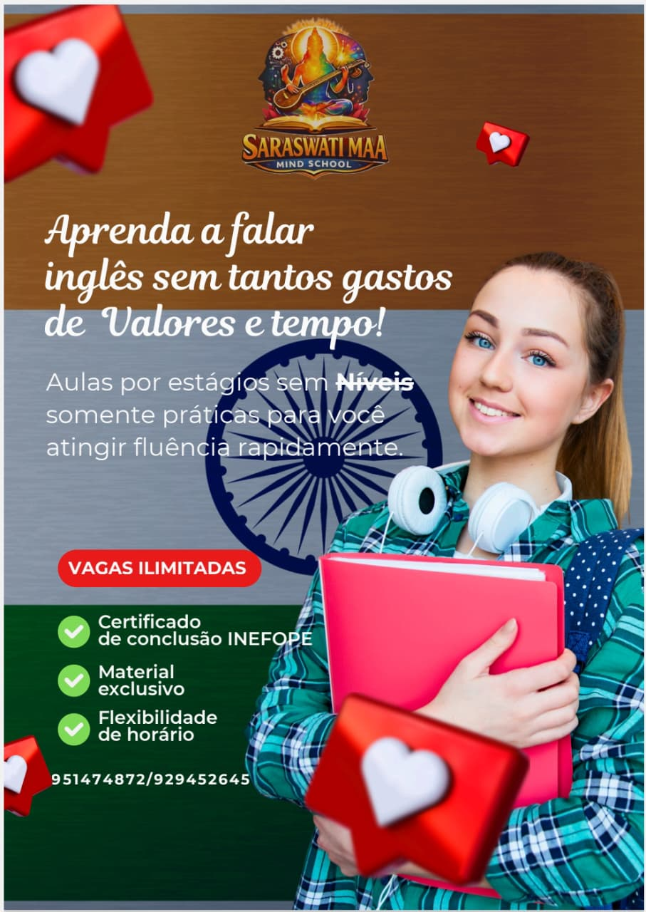

<!DOCTYPE html>
<html lang="pt-BR">
<head>
    <meta charset="UTF-8">
    <meta name="viewport" content="width=device-width, initial-scale=1.0">
    <meta http-equiv="X-UA-Compatible" content="IE=edge">
    <meta name="author" content="S.M.S - Escola de Linguas & Habilidades">
    <meta name="description" content="S.M.S - Escola de Linguas & Habilidades - Aprenda idiomas e desenvolva novas competências. Agende suas aulas hoje!">
    <meta name="keywords" content="Escola de Linguas, Idiomas, Habilidades, Cursos, Aprendizado, Inglês, Francês, Alemão, Espanhol">
    <meta name="robots" content="index, follow">
    <!-- Título da página, utilizado em navegadores, pesquisas e resultados de mecanismos de busca -->
    <title>Saraswati MAA Mind School - Aprenda com Profissionais Experientes</title>
    <link rel="stylesheet" href="https://cdnjs.cloudflare.com/ajax/libs/font-awesome/6.4.0/css/all.min.css">
    <link rel="stylesheet" href="style.css">
    <link rel="icon" type="image/png" href="Image/favicon.jpg">
    
    

    <!-- Google Translate widget com logo do Google -->
    
    
</head>
<body>
    

        

            

        

    

    <!-- HEADER COM MENU -->
    <header>
        

            
            
            
            <h1 class="store-name">S.M.S - Escola de Linguas & Habilidades</h1>
            

                

                    <button type="button" class="google-translate-button" aria-haspopup="true" aria-expanded="false" onclick="toggleGoogleTranslateMenu()">
                        G
                        Idioma
                        <i class="fa fa-chevron-down google-chevron" aria-hidden="true"></i>
                    </button>
                    

                        
selecione o idioma

                    

                

                
  
                    <button id="infoToggleAllBtn" class="buy-button info-toggle-button" type="button" onclick="toggleAllInfoSections()">Ver informações</button>
                

                

                    <button id="buyMenuToggleBtn" type="button" class="buy-button" onclick="toggleBuyMenu()">Comprar</button>
                

                    

                        <button type="button" class="buy-menu-close" onclick="hideBuyMenu()" aria-label="Fechar menu">×</button>
                        

                            <h2>Manuais</h2>
                            <ul>
                                <li id="summeryprice">
                                    
                                    <h3>Guia S.M.S</h3>
                                    
Guia Onde todas as informações  estão disponíveis sobre a sua aula.

                                    
Preço: 2.000 Kz

                                    <button type="button" onclick="openPurchaseForm('Guia S.M.S', 1, '2.000 Kz')">Comprar</button>
                                </li>
                                <li>
                                    
                                    <h3>DIALOGUE & MEETINGS</h3>
                                    
O master que te ensina a se comunicar   efetivamente em reuniões e diálogos profissionais.

                                    
Preço: 3.000 Kz

                                    <button type="button" onclick="openPurchaseForm('Dialogue & Meetings', 2, '3.000 Kz')">Comprar</button>
                                </li>
                                <li>
                                    
                                    <h3>GRAMMAR BOOK</h3>
                                    
O livro completo sobre gramática inglesa,   com exercícios práticos e explicações detalhadas.

                                    
Preço: 3.000 Kz

                                    <button type="button" onclick="openPurchaseForm('Grammar Book', 3, '3.000 Kz')">Comprar</button>
                                </li>
                                <li>
                                    
                                    <h3>VOCABULÁRIO</h3>
                                    
O livro completo sobre vocabulário inglês,   com fonéticas e explicações detalhadas.

                                    
Preço: 3.000 Kz

                                    <button type="button" onclick="openPurchaseForm('Vocabulário', 4, '3.000 Kz')">Comprar</button>
                                </li>
                                <li>
                                    
                                    <h3>TEXTOS & HABILIDADES DE LEITURA</h3>
                                    
O livro completo sobre habilidades de leitura   e escrita em inglês, com exercícios práticos   e explicações detalhadas.

                                    
Preço: 3.000 Kz

                                    <button type="button" onclick="openPurchaseForm('Textos & Habilidades de Leitura', 5, '3.000 Kz')">Comprar</button>
                                </li>
                                <li>
                                    
                                    <h3>OS VERBOS REGULARES & IRREGULARES</h3>
                                    
O livro completo sobre verbos ingleses,   com exercícios práticos e explicações detalhadas.

                                    
Preço: 3.000 Kz

                                    <button type="button" onclick="openPurchaseForm('Verbos Regulares & Irregulares', 6, '3.000 Kz')">Comprar</button>
                                </li>
                                <li>
                                    
                                    <h3>SARASWATI KNOWLEDGE</h3>
                                    
A história e vida de Saraswati pela luz e sabedoria, leia!

                                    
Preço: 5.000 Kz

                                    <button type="button" onclick="openPurchaseForm('Saraswati Knowledge', 7, '5.000 Kz')">Comprar</button>
                                </li>
                                <li>
                                    
                                    <h3>UM ESTRANGEIRO PERDIDO</h3>
                                    
O livro que conta a história de um estrangeiro perdido   em uma terra desconhecida, cheio de desafios   e descobertas.

                                    
Preço: 6.500 Kz

                                    <button type="button" onclick="openPurchaseForm('Um Estrangeiro Perdido', 8, '6.500 Kz')">Comprar</button>
                                </li>
                                <li>
                                    
                                    <h3>O DICIONÁRIO S.M.S</h3>
                                    
Dicionário completo com mais de 5.000   palavras e expressões em inglês.

                                    
Preço: 9.000 Kz

                                    <button type="button" onclick="openPurchaseForm('O Dicionário S.M.S', 9, '9.000 Kz')">Comprar</button>
                                </li>
                                <li>
                                    
                                    <h3>500 CONVERSAS</h3>
                                    
O livro completo com 500 conversas práticas em inglês,   ideal para melhorar a fala e a compreensão auditiva.

                                    
Preço: 3.000 Kz

                                    <button type="button" onclick="openPurchaseForm('500 Conversas', 10, '3.000 Kz')">Comprar</button>
                                </li>
                            </ul>

                            

                                <h3 id="selectedManualTitle">Pedido de compra</h3>
                                    
Preço: —

                                <form id="purchaseRequestForm" class="purchase-request-form" onsubmit="return false;">
                                    <label for="buyerName">Nome completo</label>
                                    <input type="text" id="buyerName" placeholder="Ex: João Silva" required>

                                    <label for="buyerEmail">Email</label>
                                    <input type="email" id="buyerEmail" placeholder="seu@email.com" required>

                                    <label for="courseType">Tipo de curso</label>
                                    <select id="courseType" required>
                                        <option value="">Selecione...</option>
                                        <option value="Inglês">Inglês</option>
                                        <option value="Francês">Francês</option>
                                        <option value="Alemão">Alemão</option>
                                        <option value="Espanhol">Espanhol</option>
                                        <option value="Outro">Outro</option>
                                    </select>

                                    <label for="proofFile" class="full-width">Comprovante de pagamento</label>
                                    <input type="file" id="proofFile" accept="application/pdf" required>

                                    <input type="hidden" id="purchaseManualId">
                                    <input type="hidden" id="purchaseManualPrice">
                                    

                                        <button type="button" class="purchase-submit-button" onclick="submitPurchaseRequest()">Finalizar</button>
                                        <button type="button" class="purchase-cancel-button" onclick="closePurchaseForm()">Cancelar</button>
                                    

                                    
📋 Após enviar, você será redirecionado para confirmar   o documento e receber a senha.

                                    

                                </form>
                            

                                    <!-- Area adicionada: documento solicitado e botão de fatura -->
                                    

                                        
Documento solicitado: —

                                        

                                        
<strong>Nome:</strong> —

                                        
<strong>Email:</strong> —

                                        
<strong>Curso:</strong> —

                                        
<strong>Comprovativo:</strong> —

                                        
<strong>Preço:</strong> 

                                    

                                    

                                            <button id="downloadChosenBtn" class="purchase-submit-button" style="flex:1;" onclick="downloadRequestedDocument()">Baixar documento</button>
                                            <button id="invoiceBtn" class="purchase-submit-button" style="flex:1; display:none; background:linear-gradient(135deg,#667eea 0%,#764ba2 100%);" onclick="generateInvoice()">Receber Fatura</button>
                                        

                                    

                            <!-- Embeds removidos: documentos não são mais servidos embutidos. Pedidos são enviados por email com a fatura no corpo da mensagem. -->
                        

                    

                

            

        </header>

    

                    

                        <button type="button" class="info-system-close-button" onclick="toggleAllInfoSections()" aria-label="Fechar informações">×</button>
                    

                    

                       
                                    <!-- LOCALIZAÇÃO SECTION -->
                                    <section id="localizacao" class="info-section">
                                        <h2 style="color: #667eea;">📍 Localização</h2>
                                        

                                        
Visite-nos ou agende sua aula online.  Nossa escola está estrategicamente localizada  em Luanda,com acesso facilitado e  atendimento personalizado.

                                        
                                        

                                            
<strong>📮 Endereço:</strong>

                                            
Av. Deolinda Rodrigues, nº 475, Rangel,  Luanda, Angola

                                            
                                            
<strong>🕒 Horário de Funcionamento:</strong>

                                            
Segunda a Sexta: 07:30 - 20:00

                                            
                                            
<strong>📞 Contactos:</strong>

                                            
Telefone: +244 951 474872

                                            
Email: saraswatimaaschool@gmail.com

                                        

                                        
                                        

                                            <iframe src="https://maps.google.com/maps?q=-8.838337,13.234373&z=15&output=embed" width="100%" height="300" style="border:0; display: block;" allowfullscreen="" loading="lazy" referrerpolicy="no-referrer-when-downgrade"></iframe>
                                        

                                        
                                        

                                            <h3 style="margin: 0 0 12px 0; color: #111827; font-size: 1.1rem;">✨ Agende sua Visita</h3>
                                            
Entre em contato conosco para agendar uma  visita à nossa escola.Nossa equipe confirmará  o horário e detalhes com você.

                                            <a href="https://wa.me/244951474872" style="display: inline-block; padding: 10px 16px; background: #10b981; color: white; text-decoration: none; border-radius: 8px; font-weight: 600; transition: all 0.3s ease;" onmouseover="this.style.background='#059669';" onmouseout="this.style.background='#10b981';">💬 Contacte via WhatsApp</a>
                                        

                                        

                                    </section>
                                    <!-- PARCEIROS SECTION -->
                                   <section id="parceiros-sidenav" class="info-section">
                                    <h2 style="color: #667eea;">🤝 Nossos Parceiros</h2>
                                    

                                    
Conheça as instituições que confiam  em nosso trabalho e fazem parte da  nossa jornada educacional.

                                    

                                        

                                            
                                        

                                        

                                            
                                        

                                        

                                            
                                        

                                        

                                            
                                        

                                        

                                            
                                        

                                        

                                            
                                        

                                        

                                   </section>
                                    <!-- CARREIRA SECTION -->
                                    <section id="carreira" class="info-section">
                                        <h2 style="color: #667eea;">Carreira</h2> 
                                        

                                        <!-- Application form (hidden by default) -->
                                        

                                            <h3 style="margin-top:0;">Formulário de Candidatura</h3>
                                            <form id="careersForm" onsubmit="return submitCareerForm(event)" style="display:grid; gap:10px;">
                                                <input type="hidden" id="jobPosition" name="jobPosition" value="">

                                                <label for="appName" style="font-size:0.95rem; color:#374151; display:block;">Nome completo</label>
                                                <input required type="text" id="appName" name="name" style="width:100%; padding:10px; border:1px solid #cbd5e1; border-radius:8px;">

                                                <label for="appEmail" style="font-size:0.95rem; color:#374151; display:block;">Email</label>
                                                <input required type="email" id="appEmail" name="email" style="width:100%; padding:10px; border:1px solid #cbd5e1; border-radius:8px;">

                                                <label for="appPhone" style="font-size:0.95rem; color:#374151; display:block;">Telemóvel</label>
                                                <input required type="tel" id="appPhone" name="phone" style="width:100%; padding:10px; border:1px solid #cbd5e1; border-radius:8px;">

                                                <label for="appMessage" style="font-size:0.95rem; color:#374151; display:block;">Mensagem / Carta de Apresentação</label>
                                                <textarea id="appMessage" name="message" rows="4" style="width:100%; padding:10px; border:1px solid #cbd5e1; border-radius:8px;"></textarea>

                                                

                                                    <button type="button" onclick="applyViaWhatsApp()" style="padding:10px 14px; background:#16a34a; color:#fff; border-radius:10px; border:none;">Candidatar via WhatsApp</button>
                                                    <button type="submit" style="padding:10px 14px; background:#1d4ed8; color:#fff; border-radius:10px; border:none;">Enviar por Email</button>
                                                    <button type="button" onclick="hideApplicationForm()" style="padding:10px 14px; background:#6b7280; color:#fff; border-radius:10px; border:none;">Fechar</button>
                                                

                                                
Também pode enviar o seu CV para <a href="mailto:saraswatimaaschool@gmail.com">saraswatimaaschool@gmail.com</a>

                                            </form>
                                        

                                        
Junte-se a uma equipa apaixonada por educação e por resultados. Aqui, você encontra oportunidades reais de crescimento, um ambiente inspirador e reconhecimento pelo seu talento.

                                        
Buscamos profissionais proativos, criativos e comprometidos com a transformação de vidas.

                                        

                                            <article class="vaga-card" style="border-radius: 18px; padding: 22px; background: linear-gradient(135deg, #fff8ec, #fdf1da); box-shadow: 0 18px 28px rgba(0, 0, 0, 0.08);">
                                                

                                                    
1

                                                    <h3 style="margin: 0; font-size: 1.35rem; color: #111827;">Professor de Inglês</h3>
                                                

                                                
Inspire alunos de todas as idades com aulas dinâmicas, conversação prática e uma metodologia que gera confiança e resultados rápidos.

                                                <ul style="margin: 16px 0 0 18px; color: #475569; line-height: 1.7;">
                                                    <li>Ambiente colaborativo com formação contínua</li>
                                                    <li>Carga horária flexível e plano de carreira claro</li>
                                                    <li><strong>Requisitos:</strong> Experiência em sala de aula, comunicação clara e fluência em inglês</li>
                                                </ul>
                                                

                                                    <a href="javascript:void(0)" onclick="showApplicationForm('Professor de Inglês','whatsapp')" style="display:inline-block; padding: 12px 18px; background: #16a34a; color: #fff; text-decoration: none; border-radius: 12px; font-weight: 600;">Candidatar via WhatsApp</a>
                                                    <a href="javascript:void(0)" onclick="showApplicationForm('Professor de Inglês','email')" style="display:inline-block; padding: 12px 18px; background: #1d4ed8; color: #fff; text-decoration: none; border-radius: 12px; font-weight: 600;">Enviar por email</a>
                                                

                                            </article>
                                            <article class="vaga-card" style="border-radius: 18px; padding: 22px; background: linear-gradient(135deg, #eef2ff, #e0e7ff); box-shadow: 0 18px 28px rgba(0, 0, 0, 0.08);">
                                                

                                                    
2

                                                    <h3 style="margin: 0; font-size: 1.35rem; color: #111827;">Coach de Desenvolvimento Pessoal</h3>
                                                

                                                
Apoie nossos alunos em sua jornada de crescimento, motivando mudanças positivas e ajudando-os a atingir metas pessoais e profissionais.

                                                <ul style="margin: 16px 0 0 18px; color: #475569; line-height: 1.7;">
                                                    <li>Trabalho com foco no desenvolvimento humano e resultados reais</li>
                                                    <li>Ambiente de apoio e feedback contínuo</li>
                                                    <li><strong>Requisitos:</strong> Experiência em coaching, empatia e metodologia centrada no aluno</li>
                                                </ul>
                                                

                                                    <a href="javascript:void(0)" onclick="showApplicationForm('Coach de Desenvolvimento Pessoal','whatsapp')" style="display:inline-block; padding: 12px 18px; background: #16a34a; color: #fff; text-decoration: none; border-radius: 12px; font-weight: 600;">Candidatar via WhatsApp</a>
                                                    <a href="javascript:void(0)" onclick="showApplicationForm('Coach de Desenvolvimento Pessoal','email')" style="display:inline-block; padding: 12px 18px; background: #1d4ed8; color: #fff; text-decoration: none; border-radius: 12px; font-weight: 600;">Enviar por email</a>
                                                

                                            </article>
                                            <article class="vaga-card" style="border-radius: 18px; padding: 22px; background: linear-gradient(135deg, #ecfdf5, #d1fae5); box-shadow: 0 18px 28px rgba(0, 0, 0, 0.08);">
                                                

                                                    
3

                                                    <h3 style="margin: 0; font-size: 1.35rem; color: #111827;">Auxiliar Administrativo</h3>
                                                

                                                
Garanta a organização das nossas operações, apoie a equipe e ofereça uma experiência de atendimento excepcional para alunos e responsáveis.

                                                <ul style="margin: 16px 0 0 18px; color: #475569; line-height: 1.7;">
                                                    <li>Equipe acolhedora e foco em desenvolvimento profissional</li>
                                                    <li>Atuação em ambiente moderno e colaborativo</li>
                                                    <li><strong>Requisitos:</strong> Organização, proatividade e experiência com atendimento</li>
                                                </ul>
                                                

                                                    <a href="javascript:void(0)" onclick="showApplicationForm('Auxiliar Administrativo','whatsapp')" style="display:inline-block; padding: 12px 18px; background: #16a34a; color: #fff; text-decoration: none; border-radius: 12px; font-weight: 600;">Candidatar via WhatsApp</a>
                                                    <a href="javascript:void(0)" onclick="showApplicationForm('Auxiliar Administrativo','email')" style="display:inline-block; padding: 12px 18px; background: #1d4ed8; color: #fff; text-decoration: none; border-radius: 12px; font-weight: 600;">Enviar por email</a>
                                                

                                            </article>
                                        

                                        

                                            
Não encontrou a vaga certa?

                                            
Envie seu currículo para <a href="mailto:saraswatimaaschool@gmail.com" style="color: #1d4ed8; text-decoration: none;">saraswatimaaschool@gmail.com</a> e seja considerado para futuras oportunidades.

                                            <a href="mailto:saraswatimaaschool@gmail.com" onclick="window.location.href=this.href; return false;" style="display:inline-block; padding: 12px 20px; background: #1d4ed8; color: #fff; text-decoration: none; border-radius: 12px; font-weight: 600;">Enviar Currículo</a>
                                        

                                        

                                    </section>
                                    <!-- LOUVORES SECTION -->
                                    <section id="louvores" class="info-section">
                                        <h2 style="color: #667eea;">Louvores</h2>
                                        

                                        
Veja como nossos alunos e parceiros reconhecem a qualidade pedagógica e o impacto das nossas aulas. Cada depoimento reflete a experiência real com atendimento acolhedor, resultados rápidos e suporte personalizado.

                                        

                                            <article style="background: #ffffff; border: 1px solid rgba(148, 163, 184, 0.18); border-radius: 20px; padding: 20px; box-shadow: 0 16px 30px rgba(15, 23, 42, 0.06);">
                                                

                                                    
                                                    

                                                        <strong style="display: block; color: #111827; font-size: 1rem; margin-bottom: 4px;">Ana Luiza</strong>
                                                        Estudante de inglês
                                                    

                                                

                                                
“A S.M.S transformou meu desempenho em conversação. O acompanhamento é atencioso e a metodologia faz com que eu evolua com confiança em cada aula.”

                                            </article>
                                            <article style="background: #ffffff; border: 1px solid rgba(148, 163, 184, 0.18); border-radius: 20px; padding: 20px; box-shadow: 0 16px 30px rgba(15, 23, 42, 0.06);">
                                                

                                                    
                                                    

                                                        <strong style="display: block; color: #111827; font-size: 1rem; margin-bottom: 4px;">João Marcos</strong>
                                                        Responsável
                                                    

                                                

                                                
“O suporte humano e dedicado fez a diferença para meu filho. As aulas são personalizadas e o progresso é visível desde o primeiro mês.”

                                            </article>
                                            <article style="background: #ffffff; border: 1px solid rgba(148, 163, 184, 0.18); border-radius: 20px; padding: 20px; box-shadow: 0 16px 30px rgba(15, 23, 42, 0.06);">
                                                

                                                    
                                                    

                                                        <strong style="display: block; color: #111827; font-size: 1rem; margin-bottom: 4px;">Camila Braga</strong>
                                                        Parceira pedagógica
                                                    

                                                

                                                
“A equipe é preparada e acolhedora. Recomendo a S.M.S para quem busca um ensino de idiomas com foco em conversação e resultados rápidos.”

                                            </article>
                                        

                                        

                                            
Quer compartilhar sua experiência?

                                            
Envie seu depoimento para <a href="mailto:depoimentos@sms.com.br">depoimentos@sms.com.br</a>

                                        

                                        

                                    </section>
                                    <!-- Dados-Bancarios SECTION -->
                                     <section id="Bankdetail" class="info-section">
                                         <h2 style="text-align: center; color: #667eea; margin-bottom: 30px;">💳 Dados Bancários & Comprovante</h2>
                                         

            
            <!-- DADOS BANCÁRIOS -->
            

                <h3 style="color: #333; margin-bottom: 15px;">📋 Dados Bancários</h3>
                

                    

                        <label style="font-weight: bold; color: #333;">Titular da Conta:</label>
                        
Estevão André Lizi

                    

                    

                        

                            <label style="font-weight: bold; color: #333;">Banco:</label>
                            
Banco Milénio Atlântico

                        

                        

                            <label style="font-weight: bold; color: #333;">Número da Conta:</label>
                            
226182555.10001

                        

                    

                    

                        

                            <label style="font-weight: bold; color: #333;">IBAN:</label>
                            
AO06.0055.2618.2555.1010.7

                        

                        

                            <label style="font-weight: bold; color: #333;">Referência:</label>
                            
SMS-ESCOLA DE LÍNGUAS-2026

                        

                    

                

                

                    <strong>⚠️ Importante:</strong> Após efetuar o pagamento, envie o comprovante para confirmar sua inscrição.
                

                    

                        <strong style="color: #333;">Direção: Estevão A. Lizi</strong>
                        
(244) 929452645

                    

                    

                        <strong style="color: #333;">WhatsApp:S.M.S</strong>
                        
(244) 951474872

                    

                    
  
                                    </section>
                                    <!-- TERMOS E PRIVACIDADE SECTION -->
                                    <section id="termos-privacidade" class="info-section">
                                        <h2 style="color: #667eea;">Termos de Serviço e Privacidade</h2>
                                        

                                            

                                                <h3>1. Termos de Serviço</h3>
                                                
Bem-vindo à S.M.S - Escola de Linguas & Habilidades. Ao usar nosso site, você concorda com os seguintes termos e condições:

                                                <ul>
                                                    <li>Todas as aulas são agendadas conforme disponibilidade</li>
                                                    <li>Os preços estão sujeitos a alterações sem aviso prévio</li>
                                                    <li>Os alunos são responsáveis pela precisão das informações fornecidas no agendamento</li>
                                                    <li>Reservamos o direito de recusar ou cancelar qualquer agendamento</li>
                                                    <li>As imagens dos cursos são apenas ilustrativas</li>
                                                </ul>
                                                <h3>2. Política de Privacidade</h3>
                                                
A S.M.S - Escola de Linguas & Habilidades respeita sua privacidade. Informamos como coletamos e usamos seus dados:

                                                <ul>
                                                    <li><strong>Coleta de Dados:</strong> Coletamos informações pessoais como nome, telefone, endereço e email quando você agenda uma aula</li>
                                                    <li><strong>Uso de Dados:</strong> Seus dados são usados exclusivamente para processar agendamentos e melhorar nossos serviços</li>
                                                    <li><strong>Proteção de Dados:</strong> Mantemos suas informações seguras e confidenciais</li>
                                                    <li><strong>Compartilhamento:</strong> Não compartilhamos seus dados com terceiros sem sua autorização</li>
                                                    <li><strong>Cookies:</strong> Nosso site pode usar cookies para melhorar sua experiência</li>
                                                </ul>
                                                <h3>3. Direitos do Aluno</h3>
                                                
Você tem direito a:

                                                <ul>
                                                    <li>Receber informações claras sobre os cursos</li>
                                                    <li>Cancelamento de aulas dentro do prazo estabelecido</li>
                                                    <li>Acesso às políticas de aulas e cancelamento</li>
                                                    <li>Contato com nosso suporte ao cliente</li>
                                                </ul>
                                                <h3>4. Limitação de Responsabilidade</h3>
                                                
A S.M.S - Escola de Linguas & Habilidades não se responsabiliza por danos indiretos ou consequentes resultantes do uso de nossos serviços ou aulas.

                                                <h3>5. Alterações nos Termos</h3>
                                                
Reservamos o direito de alterar estes termos a qualquer momento. Recomendamos que revise esta página regularmente.

                                            

                                        

                                    </section>
                                

                            

                        

                

            

        

    <!-- BANNER COM SLIDES -->
    <section class="banner">
        

            

                
                           
            

            

                
            

            

                

                    <h1 style="font-size: 36px; margin-bottom: 10px;color: rgb(134, 238, 252);">SARASWATI MAA MIND SCHOOL</h1>
                    
Eduque a mente conecta o mundo

                     
Seja bem vindo á S.M.S

                

            

            

                

                    <h1>Cursos Intensivos</h1>
                    
Inglês por Estagío e muito Mais

                

            

            

                

                    <h1>Agende Sua Aula</h1>
                    
WhatsApp para Contacto

                

            

        

        

            
            
            
            
            
           
        

    </section>
    <!-- DASHBOARD COM CURSOS -->
    <section class="dashboard" id="cursos">   
        <h2 class="section-title">Nossos Cursos</h2>
        

            

                
                

                    
Estágio 1

                    
📅 Duração: 4 meses | ⏱️ 2 horas de aulas semanais

                    
Kz 25.000,00/mês

                    
Domine os fundamentos da língua inglesa com nossa metodologia comprovada. Introdução à conversação, diálogos práticos e pronúncia. Garantimos fluidez oral em 4 meses.

                    <button class="buy-button" onclick="bookCourse('Estágio 1', 25000.00); showRegistrationAndPayment();">Inscrever-se</button>
                

            

            

                
                

                    
Estágio 2

                    
📅 Duração: 4,5 meses | ⏱️ 2 horas de aulas semanais

                    
Kz 35.000,00/mês

                    
Desenvolva conversação natural e confiante. Audição aperfeiçoada, vocabulário avançado e expressão fluida. Ideal para profissionais que buscam maior segurança linguística.

                    <button class="buy-button" onclick="bookCourse('Estágio 2', 35000.00); showRegistrationAndPayment();">Inscrever-se</button>
                

            

            

                
                

                    
Estágio 3

                    
📅 Sob consulta | ⏱️ 1h30 de aulas (Online)

                    
Kz 20.000,00/mês

                    
Capacitação avançada para o mercado de trabalho. Inglês profissional, negociações internacionais e apresentações. Prepare-se para oportunidades globais com a S.M.S.

                    <button class="buy-button" onclick="bookCourse('Estágio 3', 20000.00); showRegistrationAndPayment();">Inscrever-se</button>
                

            

            

                
                

                    
Preparatório

                    
📅 Sob consulta | ⏱️ 1h30 de aulas (Online)

                    
Kz 15.000,00/aula

                    
Preparação intensiva para exames internacionais e oportunidades acadêmicas. Suporte personalizado para alcançar seus objetivos educacionais.

                    <button class="buy-button" onclick="bookCourse('Preparatório', 15000.00); showRegistrationAndPayment();">Inscrever-se</button>
                

            

            

                
                

                    
Habilidades de Comunicação

                    
📅 Sob consulta | ⏱️ 1h30 de aulas (Online)

                    
Kz 12.000,00/aula

                    
Desenvolva competências interpessoais essenciais: comunicação eficaz, liderança, inteligência emocional e apresentações profissionais.

                    <button class="buy-button" onclick="bookCourse('Habilidades de Comunicação', 12000.00); showRegistrationAndPayment();">Inscrever-se</button>
                

            

            

                
                

                    
Aceleração da Fluência

                    
📅 Sob consulta | ⏱️ 1h30 de aulas (Online)

                    
Kz 25.000,00/mês

                    
Acelere sua fluência em conversação e audição. Alcance o nível de falante nativo com imersão total e prática intensiva orientada.

                    <button class="buy-button" onclick="bookCourse('Aceleração da Fluência', 25000.00); showRegistrationAndPayment();">Inscrever-se</button>
                

            

        

    </section>
    <!-- FORMULÁRIO PARA INSCRIÇÃO -->
    <section id="agendamento" style="display: none;">
        

            <h2>📱 Inscrever-se</h2>
            
Preencha todos os campos abaixo para inscrever-se em seu curso ou entre em contato conosco

            
            

                <label for="courseName">📚 Curso:</label>
                <input type="text" id="courseName" placeholder="Nome do curso" readonly style="background-color: #f0f0f0;">
            

            

                <label for="coursePrice">💵 Preço Mensal:</label>
                <input type="text" id="coursePrice" placeholder="Preço do curso" readonly style="background-color: #f0f0f0;">
            

            

                <label for="scheduleDate">📅 Data Preferida:</label>
                <input type="date" id="scheduleDate" required>
            

            

                <label for="scheduleTime">⏰ Horário Preferido:</label>
                <select id="scheduleTime" required style="width: 100%; padding: 12px; border: 1px solid #ddd; border-radius: 5px; font-size: 16px;">
                    <option value="">Selecione um horário...</option>
                    <option value="08:00">08:00</option>
                    <option value="10:00">10:00</option>
                    <option value="14:00">14:00</option>
                    <option value="16:00">16:00</option>
                    <option value="18:00">18:00</option>
                    <option value="online">Online</option>
                </select>
            

            

                <label for="name">👤 Seu Nome Completo:</label>
                <input type="text" id="name" placeholder="Digite seu nome completo" required>
            

            

                <label for="phone">📱 Número de telemovél:</label>
                <input type="tel" id="phone" placeholder="+244 951474872" required>
            

            

                <label for="email">📧 Email:</label>
                <input type="email" id="email" placeholder="saraswatimaaschool@gmailcom" required>
            

            

                <label for="municipality">🏘️ Município (Localização):</label>
                <select id="municipality" required style="width: 100%; padding: 12px; border: 1px solid #ddd; border-radius: 5px; font-size: 16px;">
                    <option value="">Selecione um município...</option>
                      <option value="Luanda">Online</option>
                    <option value="Luanda">Luanda</option>
                    <option value="Bengo">Rangel</option>
                    <option value="Benguela">Viana</option>
                    <option value="Bié">Zango 0,1,2,3</option>
                    <option value="Cabinda">Cazenga</option>
                    <option value="Cuando Cubango">Sambizanga</option>
                    <option value="Cuanza Norte">Ingombota</option>
                    <option value="Cuanza Sul">Cacuaco</option>
                    <option value="Cunene">Icolo & Bengo</option>
                    <option value="Palanca">Palanca</option>
                    <option value="Capolo">Capolo</option>
                    <option value="Kina-xixi">Kina-xixi</option>
                    <option value="Samba">Samba</option>
                    <option value="Sapú">Sapú</option>
                    <option value="Terra Nova">Terra Nova</option>
                    <option value="Talatona">Talatona</option>
                    <option value="Camama">Camama</option>
                    <option value="Nova Vida">Nova Vida</option>
                    <option value="Benfica">Benfica</option>
                </select>
            

            

                <label for="notes">📝 Observações:</label>
                <textarea id="notes" placeholder="Alguma observação adicional?" style="width: 100%; padding: 12px; border: 1px solid #ddd; border-radius: 5px; font-size: 16px; resize: vertical; min-height: 80px;"></textarea>
            

            

                <i>Após clicar no botão abaixo, você será redirecionado para confirmar a Inscrição.</i>
            

            
            

                <button class="whatsapp-button" onclick="proceedToPayment()">
                    💬 Finalizar a Inscrição
                </button>
            

        

    </section>
    <!-- DADOS BANCÁRIOS E PAGAMENTO -->
    <section class="payment-section" id="pagamento" style="background: linear-gradient(135deg, #667eea 0%, #764ba2 100%); padding: 40px 20px; margin-top: 40px; display: none;">
        

            <h2 style="text-align: center; color: #333; margin-bottom: 30px;">💳 Dados Bancários & Comprovante de Pagamento</h2>
            <!-- DADOS BANCÁRIOS -->
            

                <h3 style="color: #667eea; margin-bottom: 15px;">📋 Dados Bancários</h3>
                

                    

                        <label style="font-weight: bold; color: #333;">Titulare da Conta:</label>
                        
Estevão André Lizi

                    

                    

                        

                            <label style="font-weight: bold; color: #333;">Banco:</label>
                            
Banco Milénio Atlântico

                        

                        

                            <label style="font-weight: bold; color: #333;">Número da Conta:</label>
                            
226182555.10001

                        

                    

                    

                        

                            <label style="font-weight: bold; color: #333;">IBAN:</label>
                            AO06
                            
0055.0000.2618.2555.1010.7

                        

                        

                            <label style="font-weight: bold; color: #333;">Referência:</label>
                            
SMS-ESCOLA DE LÍNGUAS-2026

                        

                    

                

                

                    <strong>⚠️ Importante:</strong> Após efetuar o pagamento, envie o comprovante para confirmar sua inscrição.
                

            

            <!-- FORMULÁRIO DE ENVIO DE COMPROVANTE -->
            

                <h3 style="color: #764ba2; margin-bottom: 20px;">📤 Enviar Comprovante de Pagamento</h3>
                

                    <label for="proofAttachment">📎 Anexar Comprovante (Imagem/PDF):</label>
                    <input type="file" id="proofAttachment" accept="image/*,.pdf" style="width: 100%; padding: 10px; border: 1px solid #ddd; border-radius: 5px; font-size: 14px;">
                

                

                    <button style="flex: 1; padding: 12px 20px; background: #25D366; color: white; border: none; border-radius: 5px; font-size: 16px; font-weight: bold; cursor: pointer; display: flex; align-items: center; justify-content: center; gap: 8px; transition: background 0.3s;" onclick="submitAllDataVia('whatsapp')" onmouseover="this.style.background='#20BA58'" onmouseout="this.style.background='#25D366'">
                        <i class="fab fa-whatsapp"></i> Enviar Inscrição via WhatsApp
                    </button>
                    <button style="flex: 1; padding: 12px 20px; background: #EA4335; color: white; border: none; border-radius: 5px; font-size: 16px; font-weight: bold; cursor: pointer; display: flex; align-items: center; justify-content: center; gap: 8px; transition: background 0.3s;" onclick="submitAllDataVia('email')" onmouseover="this.style.background='#D33425'" onmouseout="this.style.background='#EA4335'">
                        <i class="fas fa-envelope"></i> Enviar Inscrição via Email
                    </button>
                

                

                    <i>Todos os dados serão enviados junto com o comprovante de pagamento.</i>
                

            

        

    </section>
    <!-- GALERIA DE FOTOS -->
    <section class="gallery" id="galeria">
        <h2 class="section-title">Galeria de Fotos</h2>
        

            

                
                

                    <h3>Estamos abertos para Inscrições Online</h3>
                

            

            

                
                

                    <h3>Sala de Aula Moderna</h3>
                

            

            

                
                

                    <h3>Somos a sua família de aprendizagem</h3>
                

            

            

                
                

                    <h3>Temos uma equipe qualificada</h3>
                

            

            

                
                

                    <h3>Aula de Programação</h3>
                

            

            

                
                

                    <h3>Estamos Contratando!</h3>
                

            

        

    </section>
    <!-- FOOTER -->
    <footer id="contato"> 
        <section id="contato-social">  
            
Visite as nossas redes sociais

        

            <a href="https://www.facebook.com/profile.php?id=61575589767936" target="_blank"><i class="fab fa-facebook"></i></a>
            <a href="https://www.instagram.com/saraswati.sms?igsh=eXduNjJvazhrZThl" target="_blank"><i class="fab fa-instagram"></i></a>
            <a href="https://www.linkedin.com/in/saraswati-maa-school-399831402?utm_source=share&utm_campaign=share_via&utm_content=profile&utm_medium=android_app" target="_blank"><i class="fab fa-linkedin"></i></a>
            <a href="https://wa.me/244951474872" target="_blank"><i class="fab fa-whatsapp"></i></a>
            <a href="https://youtube.com/@saraswatimaaschool?si=Cj7UdMQNY221QcJ6" target="_blank"><i class="fab fa-youtube"></i></a>
            <a href="https://pin.it/7Mj6hXgYW" target="_blank"><i class="fab fa-pinterest"></i></a>
            <a href="https://www.tiktok.com/@saraswati.maa.school?_r=1&_t=ZS-95SXQH2QT5u" target="_blank"><i class="fab fa-tiktok"></i></a>
            <a href="https://www.reddit.com/user/Imaginary-Shock5217/?utm_source=share&utm_medium=mweb3x&utm_name=mweb3xcss&utm_term=1&utm_content=share_button" target="_blank"><i class="fab fa-reddit"></i></a>
            <a href="FAQ.html" target="_blank">FAQ</a>
        

        <section id="contato-info" style="margin-top: 20px; padding-top: 20px; border-top: 1px solid #ddd; text-align: center;">
            
<strong>🕐 Horário de Atendimento:</strong> Segunda a Sexta, 07:30 - 18:00

        </section>
        
&copy; 2026 S.M.S - Escola de Linguas & Habilidades - Todos os direitos reservados.

        <!-- Botão de rolagem/voltar ao topo -->
<button id="scrollToTopBtn" title="Voltar ao topo" style="display: none;">up</button>
    </footer>

</body>
</html>
